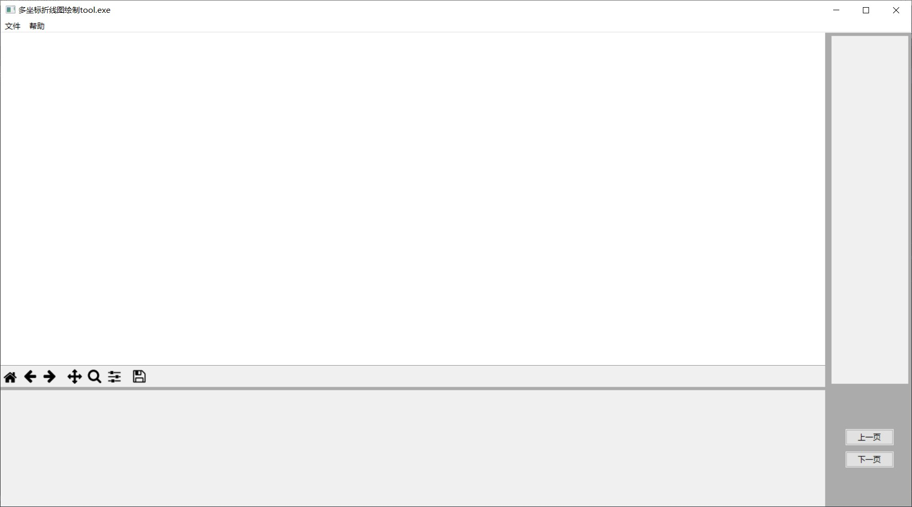
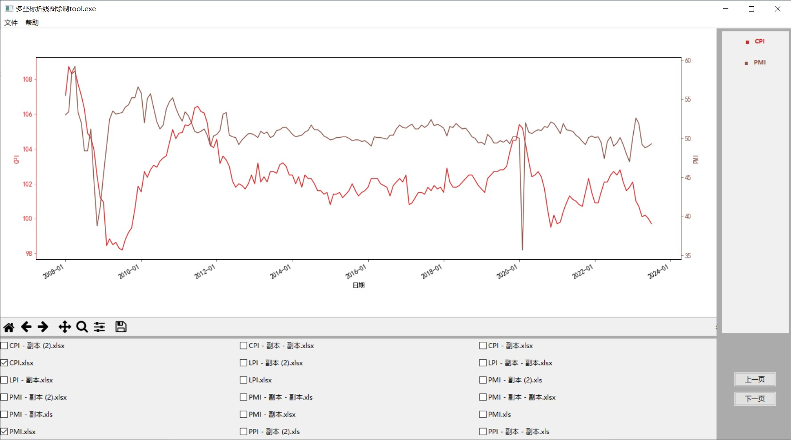
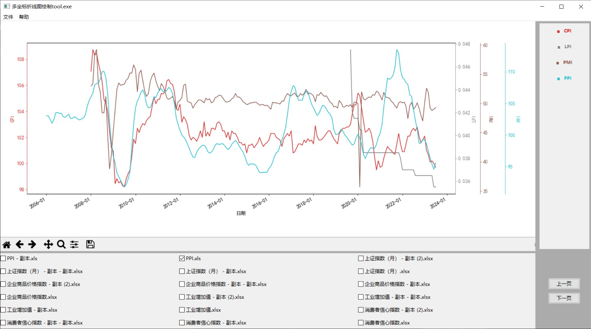

# Multi-Y-ordinate-LineChart
Using this tool, you can draw a line chart with one X coordinate and multi Y coordinate. The X coordinate is one index which all Y coordinate share, such as time, age and so on.  
Input files need to obey the rules writed in Excel_Files/Readme.txt  
As shown in the following figure, this is the effect of the program running：  
Run the program:  
  
One X coordinat with two Y coordinates:  
  
One X coordinat with more than two Y coordinates:  
  
The introduction with two languages would update the other day.

# 多Y轴折线图绘制工具
